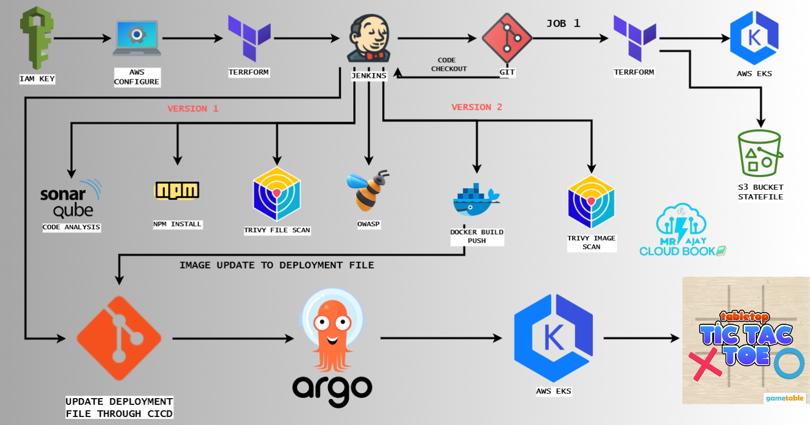

<h1 align="center">Automating TIC-TAC-TOE Deployments: DevSecOps with ArgoCD, Terraform, and Jenkins</h1>

## :rocket: Knowledges

-   `ReactJS`
-   `Framer Motion`


## the game is forked from 

```
https://github.com/ucfx/TIC-TAC-TOE-GAME.git
```
## Introduction
This project is a web-based Tic-Tac-Toe game developed to demonstrate modern DevSecOps practices, including automated deployments and security scanning. The project leverages several key technologies and tools to ensure a robust, secure, and efficient deployment pipeline.

# Features
- Real-time Multiplayer Tic-Tac-Toe: Play against other players in real-time.
- Responsive Design: Accessible on various devices.
- Secure Deployment Pipeline: Utilizes DevSecOps practices to ensure secure and efficient deployments.

# Technology Stack
- Frontend: React, Vite
- Backend: Node.js, Express
- Containerization: Docker
- CI/CD: Jenkins
- Infrastructure as Code: Terraform
- Kubernetes: AWS EKS
- GitOps: ArgoCD
- Security Scanning: Trivy, OWASP
- Code Quality: SonarQube

# Prerequisites
- Docker
- Node.js
- AWS CLI
- Terraform
- Jenkins
- ArgoCD


## The WorkFlow




## Demo Video of the game Deployment using ArgoCD and Jenkins

https://github.com/user-attachments/assets/6fa6b3b1-2d53-498e-a02f-3e46e21feaee

## Installation

# Clone the Repository
```
git clone https://github.com/AbedJoulany/TIC-TAC-TOE-GAME.git
cd TIC-TAC-TOE-GAME
```
# Docker Setup

Build and run the Docker container:

```
docker build -t tic-tac-toe-game .
docker run -p 3000:3000 tic-tac-toe-game
```


Contact
For any inquiries, please contact Abed Joulany.

